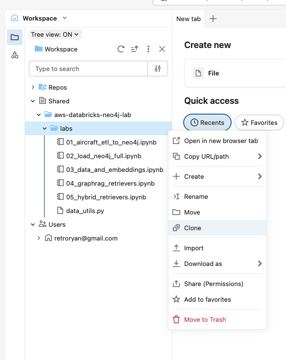

# Databricks Workspace Setup

Follow these steps to sign in to the workshop Databricks workspace and prepare your environment. After completing this guide you will have a personal copy of the lab notebooks attached to your own compute cluster, ready to run.

## Step 1 — Accept the Workspace Invitation

Your workshop admin has added you to a shared Databricks workspace. You received an email from Databricks inviting you to collaborate.

1. Click the link in the invitation email to open the Databricks sign-in page.
2. Select **Sign in with email**.
3. Databricks sends a one-time passcode (OTP) to your email address.
4. Check your inbox, copy the 6-digit code, and enter it on the sign-in page.

> **Tip:** The passcode expires after a few minutes. If it expires, click **Resend code** on the sign-in page to get a new one.

**Expected outcome:** You land on the Databricks workspace home page.

## Step 2 — Verify Your Compute Cluster

Each participant has a dedicated compute cluster pre-configured by the workshop admin. This cluster has the Neo4j Spark Connector library and other dependencies already installed.

1. Click **Compute** in the left sidebar.
2. Look for a cluster named with your identifier (e.g., `lab-<yourname>`).
3. Confirm the cluster shows a green dot or **Running** status.

If the cluster is stopped, click the cluster name to open its detail page, then click **Start**. It may take 2-3 minutes to start.


**Expected outcome:** Your personal cluster is visible and running.

## Step 3 — Clone the Lab Notebooks

The lab notebooks are stored in a shared folder. You will clone them into your own workspace so you can edit and run them without affecting other participants.

1. Click **Workspace** in the left sidebar.
2. Expand **Shared > aws-databricks-neo4j-lab > labs**.
3. Right-click on the `labs` folder and select **Clone**.



**Expected outcome:** The Clone dialog opens.

## Step 4 — Configure the Clone Destination

The Clone dialog lets you place a personal copy of the notebooks in your home directory.

1. Update the **New name** to include your initials (e.g., `labs-rk`) so it is easy to identify.
2. Select the **For you** tab.
3. Choose your home directory as the destination.
4. Click **Clone**.


**Expected outcome:** A copy of the `labs` folder appears under your home directory in the Workspace browser. It contains all notebooks and the `data_utils.py` utility module.

## Step 5 — Attach Your Compute Cluster

Each notebook must be attached to a compute cluster before it can execute code. Attaching your personal cluster ensures you have the correct Spark Connector libraries and Python packages.

1. Open the first notebook, `01_aircraft_etl_to_neo4j.ipynb`, from your cloned folder.
2. Click the **compute selector** in the top-right corner of the notebook.
3. Under **Active resources**, select your personal cluster (e.g., `lab-<yourname>`).

> **Note:** Do not use **Serverless** compute — it does not have the Neo4j Spark Connector installed.


**Expected outcome:** The notebook header shows your cluster name and a green connection indicator.

## Step 6 — Enter Your Neo4j Connection Details

The notebook connects to your Neo4j Aura instance to load data. You need to provide the credentials you received during Lab 1 (Aura setup).

1. Scroll to the **Configuration** cell near the top of the notebook.
2. Replace the placeholder values with your actual credentials:

```python
NEO4J_URI = "neo4j+s://xxxxxxxx.databases.neo4j.io"
NEO4J_USERNAME = "neo4j"
NEO4J_PASSWORD = "<your-password>"
```

> **Important:** The URI must start with `neo4j+s://` (the `+s` enables TLS encryption required by Aura).

**Expected outcome:** The configuration cell has your real Neo4j URI and password filled in.

## Step 7 — Run the Notebook

With compute attached and credentials configured, you are ready to load data.

1. Click **Run all** in the notebook toolbar.
2. Monitor the cell outputs as each step executes — you will see progress messages as Aircraft, System, and Component nodes are written to Neo4j.
3. The final verification cells display node and relationship counts.

**Expected outcome:** The notebook completes without errors and the verification cells show 20 Aircraft nodes, 80 System nodes, and 320 Component nodes in Neo4j.
