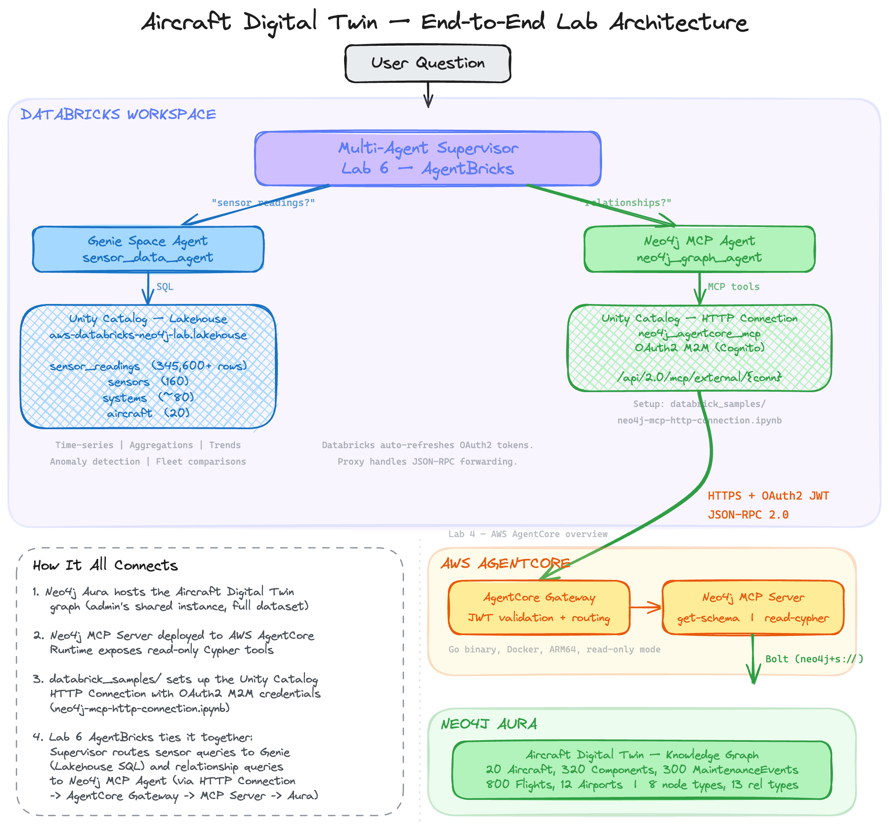

# Lab 6 - Multi-Agent Aircraft Analytics with AgentBricks

In this lab, you'll build a multi-agent system using Databricks AgentBricks that combines **Genie** (for sensor time-series analytics) with **Neo4j MCP** (for graph relationship queries). The multi-agent supervisor routes each question to the right system and, for complex questions spanning both, queries each sequentially and synthesizes a combined answer.

## Why Two Data Sources?

Aircraft intelligence requires both **time-series telemetry** and **rich relational data**, and each is best served by a purpose-built platform:

- **Genie + Lakehouse** excels at time-series sensor data — 345,600+ hourly readings stored in Delta Lake columnar format, optimized for aggregations, trend analysis, percentile calculations, and fleet-wide statistical comparisons over time. SQL is the natural language for these analytical workloads, and Genie translates natural language into SQL automatically.
- **Neo4j** excels at richly connected relational data — aircraft topology, component hierarchies, maintenance event chains, flight-to-airport routes, and delay root causes. These queries traverse multiple relationships (e.g., "Which components in the hydraulics system had maintenance events that caused flight delays?") and would require expensive multi-table JOINs in a relational database, but Neo4j handles them natively.

| System | Strength | Best For |
|--------|----------|----------|
| **Databricks (Genie)** | SQL analytics, aggregations | Time-series queries, statistics |
| **Neo4j (MCP)** | Graph traversals, pattern matching | Relationships, topology |

The multi-agent approach lets users ask questions in natural language without knowing which system to query. The supervisor intelligently routes based on the question's intent.

## Data Model

### Databricks Lakehouse (Time-Series Analytics)

These tables should already be loaded from Lab 5 setup:

| Table | Rows | Description |
|-------|------|-------------|
| `sensor_readings` | 345,600+ | Hourly sensor telemetry (90 days) |
| `sensors` | 160 | Sensor metadata (type, unit, system) |
| `systems` | ~80 | Aircraft systems (engines, avionics, hydraulics) |
| `aircraft` | 20 | Fleet metadata (tail number, model, operator) |

**Sensor Types:**
- **EGT** (Exhaust Gas Temperature): 640-700 C
- **Vibration**: 0.05-0.50 ips
- **N1Speed** (Fan Speed): 4,300-5,200 rpm
- **FuelFlow**: 0.85-1.95 kg/s

### Neo4j Knowledge Graph (Relationships)

From Lab 5 (both notebooks), your graph contains:

| Node Type | Count | Purpose |
|-----------|-------|---------|
| Aircraft | 20 | Fleet inventory |
| System | ~80 | Component hierarchy |
| Component | 320 | Parts and assemblies |
| Sensor | 160 | Monitoring equipment |
| MaintenanceEvent | 300 | Fault tracking |
| Flight | 800 | Operations |
| Delay | ~300 | Delay causes |
| Airport | 12 | Route network |
| Removal | ~60 | Component removal tracking |

### Data Overlap

**Shared data** — Aircraft, Systems, and Sensors metadata exist in both the lakehouse tables and Neo4j nodes.

**Genie-exclusive** — `sensor_readings` (345,600+ rows). The high-volume time-series telemetry lives only in the lakehouse, where SQL excels at aggregations, trends, and statistical analysis.

**Neo4j-exclusive** — Components, MaintenanceEvents, Flights, Delays, Airports, and Removals, plus the relationships between all entities (`HAS_COMPONENT`, `HAS_EVENT`, `OPERATES_FLIGHT`, `HAS_DELAY`, `HAS_REMOVAL`, etc.). These relationship-rich structures are what make graph queries powerful for topology, maintenance history, and operational analysis.

## Architecture

## Prerequisites

Before starting, make sure you have:
- Completed **Lab 5** (Databricks ETL) — run **both** notebooks:
  - `01_aircraft_etl_to_neo4j.ipynb` (core: Aircraft, System, Component)
  - `02_load_neo4j_full.ipynb` (full dataset: adds Sensors, Flights, Airports, Delays, MaintenanceEvents, Removals — **required** for the Neo4j MCP agent in Part B)
- Sensor readings data loaded in your Databricks lakehouse (Unity Catalog)
- Running in a **Databricks workspace** with AgentBricks access
- Neo4j MCP server connection configured in Unity Catalog

## Lab Overview

This lab is documentation-driven and focuses on **configuration over code**. You'll use the Databricks UI to create intelligent agents that automatically route questions to the right data source.

### Part A: Genie Space for Sensor Analytics (~30 min)

Create an AI/BI Genie space that enables natural language queries over sensor telemetry:
- Connect data sources: `sensor_readings`, `sensors`, `systems`, `aircraft`
- Add sample questions and domain-specific instructions (sensor types, normal ranges, fleet info)
- Test natural language to SQL queries for time-series aggregations and anomaly detection

### Part B: Multi-Agent Supervisor (~45 min)

Build a supervisor agent that coordinates two specialized sub-agents:
- Add the **Neo4j MCP agent** for graph relationship queries (topology, maintenance, flights)
- Add the **Genie space agent** for time-series sensor analytics (readings, trends, fleet comparisons)
- Configure routing rules so the supervisor directs questions to the right agent
- Test single-agent routing and combined multi-agent queries
- Deploy as a serving endpoint for programmatic access

## Query Routing Strategy

The supervisor routes questions based on intent:

| Question Type | Route To | Example |
|---------------|----------|---------|
| Time-series aggregations | Genie | "What's the average EGT over the last 30 days?" |
| Statistical analysis | Genie | "Show sensors with readings above 95th percentile" |
| Trend analysis | Genie | "Compare fuel flow rates between 737 and A320" |
| Relationship traversals | Neo4j | "Which components are connected to Engine 1?" |
| Pattern matching | Neo4j | "Find all aircraft with maintenance delays" |
| Topology exploration | Neo4j | "Show the system hierarchy for N95040A" |
| Combined analytics | Both | "Find aircraft with high vibration AND recent maintenance events" |

## Sample Questions

### Genie Agent (Sensor Analytics)
- "What is the average EGT temperature for aircraft N95040A?"
- "Show daily vibration trends for Engine 1 over the last month"
- "Which sensors have readings above their 95th percentile?"
- "Compare fuel flow rates between Boeing and Airbus aircraft"
- "Find the maximum N1 speed recorded across the fleet"

### Neo4j Agent (Graph Relationships)
- "Which systems does aircraft AC1001 have?"
- "Show all maintenance events affecting Engine 1"
- "Find flights that were delayed due to maintenance"
- "What components are in the hydraulics system?"
- "Which aircraft have had critical maintenance events?"

### Multi-Agent (Combined Queries)
- "Find aircraft with high EGT readings and show their recent maintenance history"
- "Which engines have above-average vibration, and what components were recently serviced?"
- "Compare sensor trends for aircraft that had delays versus those that didn't"

## Getting Started

1. **Part A** (~30 min): Create and configure the Genie space for sensor analytics
2. **Part B** (~45 min): Build the multi-agent supervisor with Neo4j integration

## Files

| File | Description |
|------|-------------|
| `README.md` | This overview document |
| `PART_A.md` | Genie Space configuration guide |
| `PART_B.md` | Multi-Agent Supervisor setup guide |

## Key Concepts

- **Genie Space**: AI/BI interface that converts natural language to SQL
- **MCP (Model Context Protocol)**: Standardized protocol for tool integration
- **Multi-Agent Supervisor**: Orchestration layer that routes questions to specialized agents
- **AgentBricks**: Databricks platform for building and deploying AI agents
- **Unity Catalog**: Governance layer for data and connections

## Performance Considerations

- **Genie**: Optimized for large-scale aggregations (345K+ readings)
- **Neo4j**: Optimized for relationship hops and pattern matching
- **Supervisor**: Adds minimal latency for routing decisions

## Next Steps

Continue to [Lab 7 - Semantic Search](../Lab_7_Semantic_Search) to add GraphRAG capabilities over maintenance documentation.

After completing the workshop, you can:
- Add more sub-agents (e.g., documentation search from Lab 7)
- Create custom tools for specific maintenance workflows
- Deploy the agent as a production service
- Integrate with external systems via additional MCP servers
