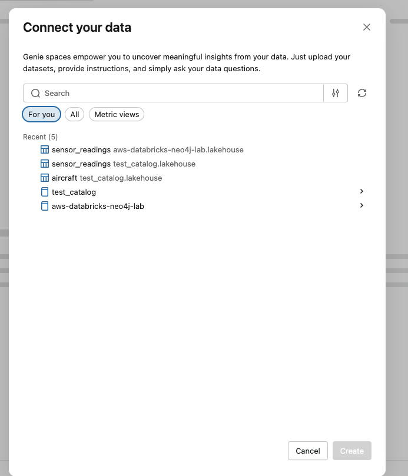

# Part A: Genie Space for Aircraft Sensor Analytics

In this part, you'll create a Databricks AI/BI Genie space that enables natural language queries over your aircraft sensor telemetry data. This Genie will become one of the sub-agents in your multi-agent system.


---

## Step 1: Explore the Lakehouse Data

Your workshop admin has pre-loaded a set of tables into Unity Catalog that represent the Aircraft Digital Twin sensor telemetry. This is the data you will use to create your Genie space — a natural language interface that lets agents query sensor readings, compare fleet metrics, and detect anomalies using SQL under the hood.

1. Click **Catalog** in the left sidebar.
2. Expand **aws-databricks-neo4j-lab > lakehouse**.
3. Browse the available tables:

| Table | Rows | Description |
|-------|------|-------------|
| `aircraft` | 20 | Fleet inventory — tail numbers, models, manufacturers, operators |
| `systems` | 80 | Aircraft systems — engines, avionics, hydraulics |
| `sensors` | 160 | Sensor metadata — EGT, vibration, N1 speed, fuel flow |
| `sensor_readings` | 345,600 | Hourly telemetry readings over 90 days (July–September 2024) |

4. Click on any table (e.g., `sensor_readings`) and select the **Sample Data** tab to preview its contents.


These four tables form a join chain — `sensor_readings` → `sensors` → `systems` → `aircraft` — that connects raw telemetry values all the way up to fleet-level metadata. The Genie space you create in the next steps will use this structure to answer natural language questions by generating SQL queries across these tables automatically.

---

## Step 2: Create the Genie Space

### 2.1 Navigate to AI/BI Genie

1. In your Databricks workspace, click **New** > **Genie space**
2. Or navigate to **AI/BI** in the left sidebar and click **New Genie space**

### 2.2 Connect Your Data

After clicking **New Genie space**, the **Connect your data** dialog appears. Select All Catalogs ->  `aws-databricks-neo4j-lab`  -> `lakehouse` -> then select `sensor_readings`, `aircraft`, `sensors`, `systems`.

> **Tip:** These tables form a join chain: `sensor_readings` -> `sensors` -> `systems` -> `aircraft`




> **Tip:** If you don't see the table under **Recent**, click **All** or use the search bar to find `aws-databricks-neo4j-lab`.

### 2.3 Configure Basic Settings

Once the Genie space is created, click **Configure** in the top navigation bar, then select the **Settings** tab:


1. **Title:** `Aircraft Sensor Analyst [YOUR_INITIALS]`
   - Example: `Aircraft Sensor Analyst RK`
2. **Description:** "Analyzes aircraft engine sensor telemetry including EGT, vibration, N1 speed, and fuel flow metrics"
3. **Default warehouse:** Select a **Serverless SQL Warehouse**

### 2.4 Add Sample Questions

Still on the **Settings** tab, scroll down to **Sample questions**. These train the Genie to understand domain-specific language. Click **+ Add** and enter these examples:

**Time-Series Analytics**

```
What is the average EGT temperature for aircraft N95040A over the last 30 days?
```

```
Show daily average vibration readings for Engine 1 on aircraft AC1001
```

```
What was the maximum fuel flow recorded in August 2024?
```

**Fleet Comparisons**

```
Compare average EGT temperatures between Boeing 737 and Airbus A320 aircraft
```

```
Which aircraft has the highest average vibration readings?
```

```
Show fuel flow rates by operator
```

**Anomaly Detection**

```
Find sensors with readings above their 95th percentile value
```

```
Show all EGT readings above 690 degrees Celsius
```

```
Which engines have N1 speed readings outside the normal range of 4500-5000 rpm?
```

**Trend Analysis**

```
Show the trend of EGT temperatures over the 90-day period for aircraft N95040A
```

```
Calculate the 7-day rolling average of vibration for Engine 1 on AC1001
```

---

## Step 4: Add Instructions

Navigate to **Configure** > **Instructions**. Instructions provide domain knowledge and query conventions. Enter the following:

```
# Aircraft Sensor Analytics Domain Knowledge

## Sensor Types and Normal Ranges
- EGT (Exhaust Gas Temperature): Normal range 640-700 degrees Celsius, measured in C
- Vibration: Normal range 0.05-0.50 inches per second, measured in ips
- N1Speed (Fan Speed N1): Normal range 4,300-5,200 RPM, measured in rpm
- FuelFlow: Normal range 0.85-1.95 kg/s, measured in kg/s

## Fleet Information
- 20 aircraft in the fleet
- 4 operators: ExampleAir, SkyWays, RegionalCo, NorthernJet
- Models: B737-800 (Boeing), A320-200 (Airbus), A321neo (Airbus), E190 (Embraer)

## Sensor Configuration
- Each aircraft has 2 engines
- Each engine has 4 sensors: EGT, Vibration, N1Speed, FuelFlow
- Total: 160 sensors across the fleet (20 aircraft x 2 engines x 4 sensors)

## Data Conventions
- Timestamps are stored as timestamp type in the `timestamp` column
- Data period: July 1, 2024 to September 29, 2024 (90 days)
- Readings are hourly (24 per day per sensor)
- 2,160 readings per sensor over the 90-day period

## Sensor ID Format
- Format: AC{aircraft_number}-S{system_number}-SN{sensor_number}
- Example: AC1001-S01-SN01 = Aircraft 1001, Engine 1 (S01), EGT sensor (SN01)
- S01 and S02 are always engines; S03 is Avionics; S04 is Hydraulics
- SN01=EGT, SN02=Vibration, SN03=N1Speed, SN04=FuelFlow

## Engine Names by Model
- B737-800: CFM56-7B engines
- A320-200: V2500-A1 engines
- A321neo: PW1100G engines
- E190: CF34-10E engines

## Query Conventions
- When asked about "Engine 1", filter by systems where name contains "#1"
- When asked about "Engine 2", filter by systems where name contains "#2"
- Use tail_number for human-readable aircraft references (e.g., N95040A)
- Use aircraft_id for internal references (e.g., AC1001)
- Always include units in results (C, ips, rpm, kg/s)
```

---

## Step 5: Test the Genie

### 5.1 Start a Conversation

Click **Start conversation** or go to the chat interface.

### 5.2 Test Basic Queries

Try these progressively complex queries:

**Query 1: Simple Aggregation**
```
What is the average EGT temperature across all sensors?
```
Expected: A single number around 650-680 degrees Celsius

**Query 2: Filtering by Aircraft**
```
Show the average EGT for aircraft N95040A
```
Expected: Average EGT for that specific aircraft

**Query 3: Time-Series Trend**
```
Show daily average EGT for aircraft AC1001 in July 2024
```
Expected: ~30 rows with date and average value

**Query 4: Cross-Table Join**
```
Compare average vibration readings by aircraft model
```
Expected: Results grouped by B737-800, A320-200, A321neo, E190

**Query 5: Statistical Analysis**
```
Find the top 5 sensors with the highest average readings for their type
```
Expected: Top sensors with their average values and types

### 5.3 View the SQL Generation

For each query, click **View Code** to see the generated query is correct:

Example for "Compare average vibration by aircraft model":
```sql
SELECT
    a.model,
    AVG(r.value) as avg_vibration,
    COUNT(*) as reading_count
FROM sensor_readings r
JOIN sensors sen ON r.sensor_id = sen.sensor_id
JOIN systems s ON sen.system_id = s.system_id
JOIN aircraft a ON s.aircraft_id = a.aircraft_id
WHERE sen.type = 'Vibration'
GROUP BY a.model
ORDER BY avg_vibration DESC
```

---

## Step 6: Save and Note the Genie Space ID

### 6.1 Save Configuration

Click **Save** to preserve your Genie space configuration.

### 6.2 Record the Genie Space Name

Note the exact name of your Genie space (e.g., `Aircraft Sensor Analyst RK`). You'll need this in Part B when configuring the multi-agent supervisor.

---

## Summary

You've created a Genie space that can:

- Query 345,600+ sensor readings using natural language
- Aggregate by aircraft, model, operator, or sensor type
- Perform statistical analysis (averages, percentiles, standard deviation)
- Join across the data model to provide context-rich answers
- Understand domain-specific terminology (EGT, N1Speed, etc.)

---

---

## Next Steps

Proceed to **Part B** to create the multi-agent supervisor that combines this Genie space with the Neo4j MCP agent for comprehensive aircraft intelligence.
