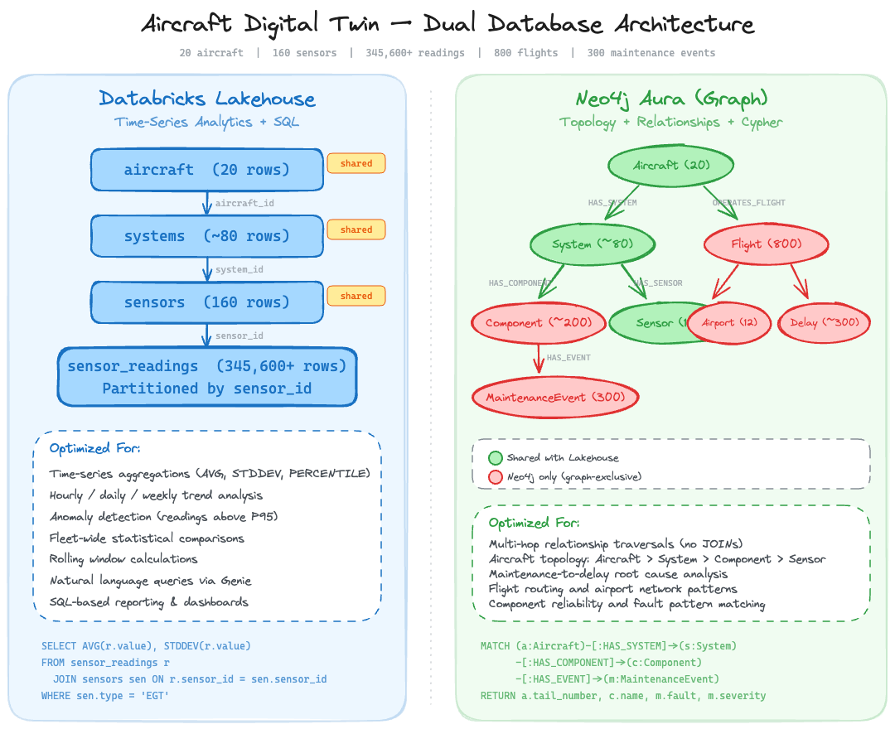

# Hands-On Lab: Neo4j, AWS, and Databricks

Build AI Agents and Knowledge Graphs with Neo4j, AWS Bedrock, and Databricks.

This hands-on workshop teaches you how to build production-ready AI agents that combine the power of graph databases with modern cloud platforms. You'll work with a comprehensive Aircraft Digital Twin dataset, learning to load data into Neo4j, query it with natural language, and build multi-agent systems that intelligently route questions to the right data source.

## Overview

**Total Duration:** ~5 hours

Participants start with a guided overview of AWS Bedrock and AgentCore, then work through lab exercises in Databricks and Neo4j Aura for graph exploration. AWS Bedrock and AgentCore provide pre-deployed infrastructure, while Databricks provides the notebook environment and multi-agent orchestration.

### Data Overview

The workshop uses a comprehensive **Aircraft Digital Twin** dataset that models a complete aviation fleet over 90 operational days. The data is split across two platforms, each chosen for the workload it handles best:

- **Databricks Lakehouse** stores the **time-series sensor telemetry** — 345,600+ hourly readings across 90 days. Columnar storage and SQL make the Lakehouse ideal for aggregations, trend analysis, and statistical comparisons over large volumes of timestamped data.
- **Neo4j Aura** stores the **richly connected relational data** — aircraft topology, component hierarchies, maintenance events, flights, delays, and airport routes. A graph database handles multi-hop relationship traversals natively, avoiding the expensive JOINs a tabular database would require for queries like "Which components caused flight delays?"

### Data Architecture Overview



Together the dataset includes the following -  see [Data Architecture](docs/DATA_ARCHITECTURE.md) for full schema details:

- **20 Aircraft** with tail numbers, models, and operators
- **80 Systems** (Engines, Avionics, Hydraulics) per aircraft
- **320 Components** (Turbines, Compressors, Pumps, etc.)
- **160 Sensors** with monitoring metadata
- **345,600+ Sensor Readings** (hourly telemetry over 90 days)
- **800 Flights** with departure/arrival information
- **300 Maintenance Events** with fault severity and corrective actions
- **12 Airports** in the route network

### Key Technologies used in the Workshop

| Technology | Purpose |
|------------|---------|
| **Neo4j Aura** | Graph database for storing aircraft relationships |
| **Neo4j Aura Agents** | No-code AI agents with Cypher Templates, Text2Cypher, and Similarity Search |
| **AWS Bedrock** | Foundation models for AI agent reasoning |
| **AWS AgentCore** | Pre-deployed Neo4j MCP Server and Agent infrastructure |
| **Databricks** | Notebooks, Unity Catalog |
| **AI/BI Genie** | Natural language analytics over Unity Catalog tables |
| **AgentBricks** | No-code multi-agent supervisor combining multiple data sources |
| **GraphRAG** | Graph-enhanced retrieval combining vector search with graph traversal |
| **Neo4j Spark Connector** | ETL from Databricks to Neo4j |
| **Model Context Protocol (MCP)** | Standard for connecting AI models to data sources |

### Workshop Infrastructure


The workshop uses a mix of shared and personal resources. Shared resources are pre-configured by administrators so participants can focus on the labs; personal resources give each participant their own environment to work in.

| Resource | Description | Shared / Personal |
|----------|-------------|-------------------|
| **Reference Aura Instance** | Fully populated Neo4j Aura database with the complete Aircraft Digital Twin — all 9 node types, 12 relationship types, maintenance manual chunks, vector embeddings, and extracted operating-limit entities | Shared |
| **Neo4j MCP Server** | Neo4j MCP server deployed to AWS AgentCore, connected to the Reference Aura Instance | Shared |
| **AgentCore Sample Agent** | Pre-deployed AgentCore agent that calls the Neo4j MCP server for natural language graph queries (Lab 4) | Shared |
| **Personal Aura Instance** | Each participant receives their own Neo4j Aura database to load data into during the ETL labs and explore independently | Personal |
| **Databricks Data & Tables** | CSV data files in a Unity Catalog Volume and pre-created Lakehouse tables (`aircraft`, `systems`, `sensors`, `sensor_readings`) | Shared |
| **Databricks MCP Connection** | External MCP server registered in Unity Catalog, pointing to the AgentCore-hosted Neo4j MCP server | Shared |
| **Databricks Workspace** | Each participant clones notebooks and runs them on a shared cluster to ETL CSV data into their personal Aura instance and build agents | Personal |

---

## Setup Notes

If you are **attending a workshop**, the Databricks environment (cluster, libraries, data, and tables) has already been configured for you — skip straight to the labs.

If you are **running this on your own** or are a **lab administrator** preparing the environment for participants, see the [Lab Admin Setup Guide](lab_setup/README.md) for instructions on creating the cluster, installing libraries, uploading data, and configuring Databricks Genie.

### Neo4j Instances

Each participant receives their own **personal Neo4j Aura instance** for hands-on work — loading data via the Spark Connector (Lab 5), building vector indexes (Lab 7), and exploring the graph in the Aura console (Lab 8). Depending on how far you get in Lab 5, your personal instance may contain a subset of the full dataset.

In addition, the workshop administrators have set up a **shared Neo4j Aura instance** that contains the **complete Aircraft Digital Twin dataset** (all nodes, relationships, and indexes). A Neo4j MCP server has been pre-configured against this shared instance. Labs that use the MCP server — such as the AgentBricks multi-agent supervisor (Lab 6) and the AWS AgentCore agent (Lab 4) — connect to the shared instance so that every participant works with the full graph regardless of their personal instance's state.

---

## Lab Structure

### Phase 1: Setup & AWS AgentCore Overview

*Get connected to all workshop resources and explore pre-deployed AI agent infrastructure.*

#### Part A: Sign In & Neo4j Aura Credentials
- [Lab 0 - Sign In](Lab_0_Sign_In) - Access workshop resources
- [Lab 1 - Neo4j Aura Setup](Lab_1_Aura_Setup) - Save connection credentials

#### Part B: AWS Console Tour *(shared infrastructure)*
- Read-only walk-through of Bedrock and AgentCore
- View the pre-deployed Neo4j MCP server (AgentCore Gateway + MCP Server Hosting)
- View the AgentCore agent deployment that calls the Neo4j MCP server
- Understand the architecture: `AgentCore Agent → AgentCore Gateway → Neo4j MCP Server → Neo4j Aura`

#### Part C: AgentCore Agent Sandbox Testing (No-Code) *(shared — queries the Reference Aura Instance)*
- [Lab 4 - AWS AgentCore](Lab_4_AWS_Agent_Core/README.md) - Use the AgentCore Agent Sandbox
- Interactively test the deployed agent without writing code
- Send natural language questions about the aircraft data
- See agent reasoning and Cypher query generation in real-time

---

### Phase 2: Databricks ETL & Multi-Agent Analytics

*Load aircraft data into Neo4j and build a multi-agent supervisor that combines the Databricks Lakehouse with the Neo4j knowledge graph — two purpose-built systems for two fundamentally different types of data.*

In this phase you'll construct a knowledge graph in Neo4j using the Spark Connector and Python driver, then build a multi-agent system that intelligently routes questions to either Databricks Genie (for sensor time-series analytics) or Neo4j MCP (for graph relationship queries).

**Participant Experience:** Pre-configured environment with CSV files in Unity Catalog Volume and ready-to-run notebooks.

**Data Location:** `/Volumes/aws-databricks-neo4j-lab/lab-schema/lab-volume/`

#### Part A: Databricks Workspace Access
- Workspace credentials and cluster access
- Import notebooks to your workspace

#### Part B: Load Data with Spark Connector *(personal — loads into your Aura instance)*
- [Lab 5 - Databricks ETL to Neo4j](Lab_5_Databricks_ETL_Neo4j/README.md) | [Sample Queries](Lab_5_Databricks_ETL_Neo4j/SAMPLE_QUERIES.md)
- Walk through the same ETL process used to build the Reference Aura Instance, loading into your personal instance
- Load core aircraft topology (Aircraft, System, Component) via Spark Connector
- Load full dataset (Sensors, Airports, Flights, Delays, Maintenance Events, Removals) via Python driver
- Validate with Cypher queries and explore in Neo4j Aura

#### Part C: Multi-Agent Aircraft Analytics with AgentBricks *(shared — Lakehouse tables + Reference Aura via MCP)*
- [Lab 6 - AgentBricks](Lab_6_AgentBricks/README.md) - No-code multi-agent system using Databricks AgentBricks
- Create an AI/BI Genie space for sensor analytics over shared Unity Catalog tables
- Build a multi-agent supervisor combining Genie Space + Neo4j MCP (queries the Reference Aura Instance)
- Test cross-system queries spanning both time-series telemetry and graph relationships

---

### Phase 3: Semantic Search & GraphRAG *(personal — loads into your Aura instance)*

*Add semantic search capabilities to the knowledge graph — chunk maintenance documentation, generate vector embeddings, and build GraphRAG retrievers that blend similarity search with graph traversal.*

- [Lab 7 - Semantic Search](Lab_7_Semantic_Search/README.md)
- Load the A320-200 Maintenance Manual into Neo4j as Document/Chunk nodes
- Generate embeddings using Databricks Foundation Model APIs
- Create a vector index for similarity search
- Build GraphRAG retrievers combining vector search with graph traversal
- Compare standard vector retrieval vs. graph-enhanced retrieval results

---

### Phase 4: Neo4j Aura Exploration *(shared — uses the Reference Aura Instance)*

*Explore the fully populated knowledge graph and create a no-code AI agent on top of it.*

Open [console.neo4j.io](https://console.neo4j.io), sign in, and select the Reference Aura Instance to begin exploring.

#### Part A: Data Exploration in Aura
- [Exploration Guide](Lab_8_Aura_Agents/README.md#part-a-data-exploration-in-aura) — Guided Cypher queries in the Aura Query interface
- Visualize aircraft topology, flight routes, maintenance history, and component removals
- Discover cross-entity patterns like shared faults and delay-prone airports

#### Part B: Build an Aura Agent (No-Code)
- [Lab 8 - Aura Agents](Lab_8_Aura_Agents/README.md) - Create AI-powered graph assistants
- Add **Cypher Template** tools for controlled, precise lookups (e.g., company overview, shared risks)
- Add a **Similarity Search** tool over the vector index for semantic retrieval
- Add a **Text2Cypher** tool for ad-hoc natural language questions
- Test the agent across all three retrieval patterns and observe tool selection reasoning

---

## Sample Queries

### Aircraft Topology
```cypher
// What systems does aircraft N95040A have?
MATCH (a:Aircraft {tail_number: 'N95040A'})-[:HAS_SYSTEM]->(s:System)
RETURN a.tail_number, s.name, s.type
```

### Maintenance Analysis
```cypher
// Find aircraft with critical maintenance events
MATCH (a:Aircraft)-[:HAS_SYSTEM]->(s:System)-[:HAS_COMPONENT]->(c:Component)
      -[:HAS_EVENT]->(m:MaintenanceEvent {severity: 'Critical'})
RETURN a.tail_number, s.name, c.name, m.fault, m.reported_at
ORDER BY m.reported_at DESC
```

### Flight Operations
```cypher
// Find delayed flights and their causes
MATCH (a:Aircraft)-[:OPERATES_FLIGHT]->(f:Flight)-[:HAS_DELAY]->(d:Delay)
RETURN a.tail_number, f.flight_number, d.cause, d.minutes
ORDER BY d.minutes DESC
LIMIT 10
```

---

## Prerequisites

- **Laptop** with a modern web browser
- **Network Access** to AWS Console, Databricks, and Neo4j Aura
- No local software installation required

---

## Quick Start Options

| Track | Labs | Duration | Description |
|-------|------|----------|-------------|
| **Console Tour Only** | Phase 1 | 2 hours | Explore AWS and Neo4j consoles without coding |
| **ETL + Multi-Agent** | Phases 1-2 | 3.5 hours | Load data and build multi-agent systems with AgentBricks |
| **Full Databricks** | Phases 1-3 | 4.5 hours | ETL, multi-agent analytics, and semantic search |
| **Full Workshop** | All Phases | 5 hours | Complete hands-on experience |

---

## Resources

- [Neo4j Aura](https://neo4j.com/cloud/aura/)
- [Neo4j Spark Connector](https://neo4j.com/docs/spark/current/)
- [Neo4j MCP Server](https://github.com/neo4j/mcp)
- [Amazon Bedrock](https://aws.amazon.com/bedrock/)
- [Amazon Bedrock AgentCore](https://docs.aws.amazon.com/bedrock-agentcore/)
- [Databricks Agent Bricks](https://docs.databricks.com/en/generative-ai/agent-bricks/)
- [Databricks Unity Catalog](https://docs.databricks.com/en/data-governance/unity-catalog/)
- [Model Context Protocol](https://modelcontextprotocol.io/)

---

## Feedback

We'd appreciate your feedback! Open an issue at [github.com/neo4j-partners/aws-databricks-neo4j-lab/issues](https://github.com/neo4j-partners/aws-databricks-neo4j-lab/issues).
